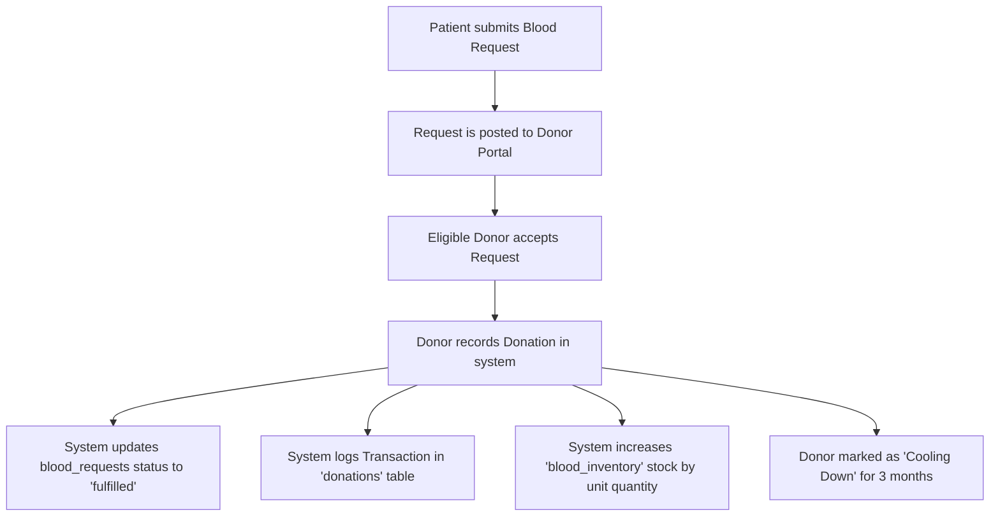

# 🩸 Blood Bridge – Blood Donation & Management System

**Blood Bridge** is a state-of-the-art web application built using the modern **Jakarta EE** MVC architecture. It serves as a secure, real-time connector between voluntary blood donors, patients, and healthcare networks, streamlining emergency request dispatching and blood inventory control.

---

## 🌟 Core Features

### 👤 Role-Based Portals & Access Control
* **Verified Donors**: Access stats, view active emergency requests, record donations, and check temporary eligibility countdowns.
* **Patients**: Search for compatible blood donors near them, save preferred donors to a personal **Wishlist**, and submit emergency requests.
* **System Administrators**: Manage global user approvals, review stock shortages, and track fulfillment statistics.

### 📅 Advanced Donor Eligibility Engine
* Tracks and enforces the medical standard **3-month (90-day) cooling period** between whole blood donations.
* Automatically displays a live countdown/ineligibility status (`⏳ Next Eligible Date`) on the donor dashboard if a donation was made recently.

### ❤️ Patient Wishlist Portal
* Allows patients to add compatible, active, or preferred donors to a personalized dynamic grid.
* Stored securely in-session to avoid database locks and ensure ultra-low latency requests.
* Single-click direct **💉 Request Donation** and **❌ Remove** operations.

### 📦 Automated Inventory Control
* Dynamically deducts/updates stock levels of specific blood groups (`A+`, `O-`, etc.) upon successful donation fulfillments.
* Normalized auditing tracks requests, donations, and inventory updates cleanly via standard relational foreign keys.

---

## ⚙️ Working Mechanisms & System Logic

### 1. The Donation & Fulfillment Pipeline


### 2. Database Normalization & Relationship Design
To maintain database integrity, relationships are mapped with strict foreign key constraints:
* **`users` Table**: Master account credentials, role mapping (`donor`, `patient`, `admin`), and verification status (`pending`, `approved`, `rejected`).
* **`donors` & `patients` Tables**: Profile-specific details linked to the `users` table via `user_id`.
* **`donations` Table**: Acts as the central junction. Storing both `request_id` and `inventory_id` in this table allows the system to audit precisely which donation fulfilled which request and updated which stock record, keeping the `blood_requests` table lightweight and Normalized (avoiding redundant duplicate columns).

---

## 🛠️ System Architecture

* **Framework**: Jakarta EE 10 (`jakarta.servlet.*`)
* **Presentation Layer**: JSP (JavaServer Pages), JSTL, HSL tailored CSS variables, responsive sidebars, Glassmorphism UI card styling.
* **Controller Layer**: MVC Servlets (`PatientController`, `DonorController`, `AuthController`).
* **Data Access Layer**: DAO Pattern with raw JDBC prepared statements and secure connection pooling.
* **Security Layer**:
  * `AuthFilter`: Enforces global login sessions and whitelists public assets (`/css/*`, `/js/*`, `/team/*`).
  * `RoleFilter`: Strict routing guard blocking unauthorized access to role boundaries (`/admin/*`, `/donor/*`, `/patient/*`).

---

## 🚀 Setup & Installation Guide

### Prerequisites
* **Java Development Kit (JDK)**: 17 or higher
* **Web Container**: Apache Tomcat 10.x (Jakarta EE compatible)
* **Database**: MySQL Server 8.x
* **Build System**: Maven

### 1. Database Configuration
1. Create a MySQL database named `bloodbridge`.
2. Update your credentials in [DBConnection.java](src/main/java/com/blooddonationmanagementsystem/util/DBConnection.java):
   ```java
   private static final String URL = "jdbc:mysql://localhost:3306/bloodbridge";
   private static final String USER = "root";
   private static final String PASSWORD = "your_mysql_password";
   ```
3. Run the database initialization script (DDL) on your MySQL instance.

### 2. Deployment on Apache Tomcat
#### Via IntelliJ IDEA (Recommended)
1. Import the project as a **Maven Project**.
2. Go to **File** $\rightarrow$ **Project Structure** $\rightarrow$ **Artifacts** and ensure `Blood_Donation_Management_System:war exploded` is configured.
3. Configure a local **Tomcat Server** Run Configuration.
4. Deploy the exploded WAR artifact.
5. Access the portal at `http://localhost:8081/Blood_Donation_Management_System_war_exploded/`.

#### Via Maven Command Line
Build the target WAR package:
```bash
./mvnw clean package
```
Copy the compiled `.war` from the `target/` directory directly into your Tomcat `webapps/` folder.

---

## 👥 Developers & Board Members

* **Sonam Acharya** — *CEO & Founder*
* **Pema Tamang** — *Backend Lead*
* **Dikshya Rai** — *Frontend Lead*
* **Diya Siwakoti** — *UI/UX Designer*
* **Nirjal Guragain** — *Full Stack Developer*

---
*Developed with ❤️ for saving lives.*
